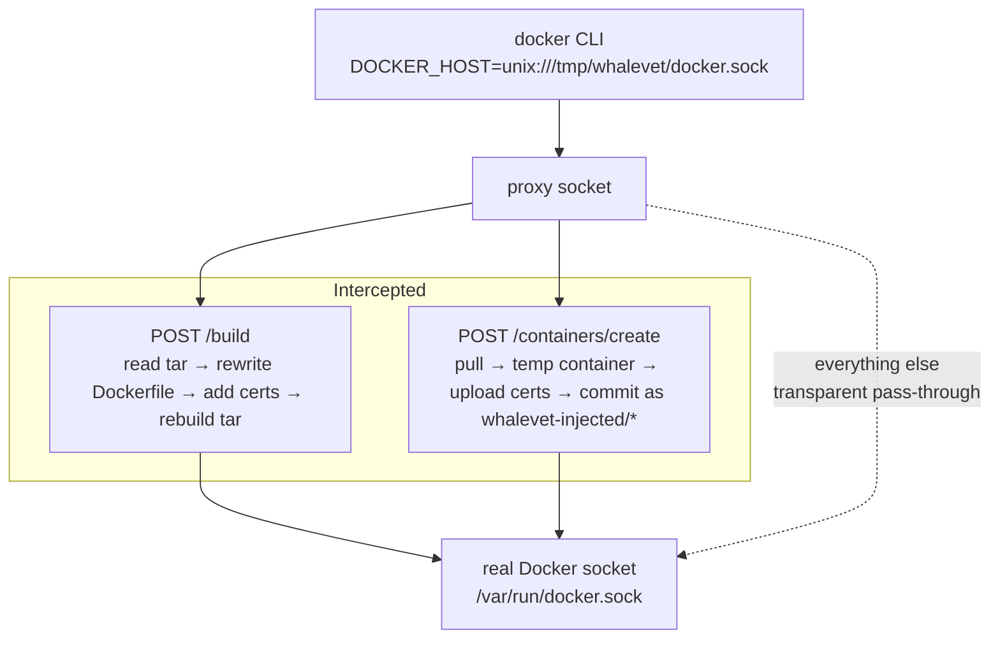

# Whalevet

Whalevet is a reverse proxy for the Docker Engine API. It sits between your
`docker` CLI and the Docker daemon. It changes `docker build` (and `docker run`
/ `container create`) so your images get extra setup:

- Dockerfile instructions
- environment variables
- CA certificates

It works with both the legacy builder and BuildKit.

The proxy listens on a Unix socket. Point `DOCKER_HOST` at the proxy and keep
using your normal `docker` commands. Only build and create calls change; all
other requests pass through untouched.

## Why

Corporate VPNs often break certificate chains inside containers. Whalevet
lets your containers trust an internal CA without editing every Dockerfile.

## How it works



## Install and setup

```bash
# requires mise (https://mise.jdx.dev); installs the GitHub release binary
mise use -y github:mralves/whalevet
```

```bash
whalevet setup            # asks before each step (systemd service and
                          # DOCKER_HOST default to no)
whalevet doctor           # verify setup and fix mistakes
```

`setup` asks you to confirm each step:

- **Install and start `whalevet.service`** as a systemd **user** service
  `[y/N]`. Restarted if already running.
- **Set `DOCKER_HOST`** in your shell rc `[y/N]`.

Whalevet waits for your input. An empty answer uses the default (shown in
brackets).

Default config: `~/.config/whalevet/config.toml` (override with `--config`).

## Usage

```text
whalevet [--config PATH] <command> [args]

Commands:
  serve [socket]   Start the proxy server. An optional socket overrides the
                   listen address from the config file. Watches the config
                   file and reloads it on change or SIGHUP.
  setup            Install a systemd user service, and set DOCKER_HOST in
                   the shell rc.
  validate         Check the config file (rule syntax, certs, templates,
                   positions, policy) and exit non-zero on problems.
  status           Show the state of the install (config, socket, service,
                   shell rc). Always exits 0.
  doctor           Verify that setup was done correctly and report mistakes.
  uninstall        Remove the systemd service, shell rc entry, and all
                   whalevet images. Confirms unless --yes is passed.
  prune            Remove whalevet-injected images. Confirms unless --yes is
                   passed.
```

Run `whalevet serve` from systemd, or manually:

```bash
whalevet serve
```

The server watches `config.toml` and reloads it as soon as it changes (using
inotify/fsnotify). It also reloads on `SIGHUP` (from systemd that is
`systemctl --user reload whalevet`). On reload the server:

- re-reads the config
- swaps the new config into the running proxy

If the listen address changed (or you passed a socket override), the listener
moves to the new address without restarting. A config that fails to load is
rejected; the current one stays active.

## Configuration

See [`config-example.toml`](config-example.toml) for the full annotated file.

```toml
[proxy]
listen = "unix:///tmp/whalevet/docker.sock"  # proxy socket (default)
docker_socket = "/var/run/docker.sock"          # real daemon socket

[[injections]]
type = "ca_certificates"
certificates = ["/etc/ssl/certs/internal-ca.pem"]

[[injections]]
type = "run"
command = "apt-get update && apt-get install -y curl jq"
position = "after_base"   # or "before_entrypoint"

[[injections]]
type = "from"
pattern = "^ubuntu:"
replacement = "my-registry.internal/ubuntu:"

[[injections]]
type = "env"
env = { HTTP_PROXY = "http://proxy.internal:8080" }

[policy]
deny = ["evil/image/**"]   # optional glob allow/deny on pulls and creates
```

### Injection types

| type              | what it does                                                        |
|-------------------|---------------------------------------------------------------------|
| `ca_certificates` | installs PEM certs into the image's CA bundle, sets trust env vars  |
| `run`             | runs a shell command `after_base` or `before_entrypoint`            |
| `from`            | rewrites base image references across every `FROM` line (regex)     |
| `env`             | injects `ENV` lines (keys sorted, case preserved)                   |

`env` rules can load `KEY=VALUE` pairs from a file with `env_file`
(docker-compose style: `#` comments and quoted values are supported). The
path is relative to the config file's directory. Inline `env` entries win
over the same key from the file. See [`config-example.toml`](config-example.toml)
for a sample.

CA env injection sets the standard trust variables
(`SSL_CERT_FILE`, `SSL_CERT_DIR`, `CURL_CA_BUNDLE`, `REQUESTS_CA_BUNDLE`,
`PIP_CERT`, `NODE_EXTRA_CA_CERTS`, ...). Values support Go
`text/template` placeholders such as `{{.BundlePath}}`, `{{.TrustDir}}`,
`{{.CertDir}}`, so the build env matches what the running container gets.

### Image policy

`[policy]` limits which images may be pulled or created as containers. It
uses Unix-style globs (`*` does not cross `/`, `**` does, `?` matches a
single character). Deny entries always win. If `allow` is non-empty, a
reference must match it. Whalevet's own injected images are always
allowed. Pulls are checked on `POST /images/create`; container creates on
`POST /containers/create`. Denied requests get HTTP 403 with a Docker-style
JSON body. Audit events (`pull_denied`, `create_denied`) are logged as
structured journald-style JSON.

### Audit logging

The proxy writes structured JSON events to stderr. They match `journald`'s
structured fields (`MESSAGE`, plus per-event attrs). Events cover builds
(`build`), container creates (`container_create`, cached or fresh), and
policy denials.

### BuildKit

The proxy applies the same injection rules to BuildKit builds. No wrapper
image or `# syntax=` directive is needed: the daemon (or `docker buildx`)
streams the Dockerfile through the proxy socket on the way to BuildKit, and
whalevet rewrites it there, exactly like the legacy builder's `DOCKER_HOST`
path.

```bash
# point DOCKER_HOST at the proxy socket and build as usual
whalevet serve
docker buildx build --no-cache .
```

The rewrite targets both the `buildx` docker driver and daemon-side BuildKit
builds (the `/session` diffcopy stream and the `/build`/`/grpc` build
backend), covering `FROM`, `RUN`, `ENV` and base-image `ca_certificates`
rules just like the legacy path.

## Prerequisites

- Go 1.27 (development only)
- Mise (development only)
- Linux host (the proxy listens on a Unix socket)
- Docker Engine 20.10 – 28.x (Engine API v1.41 – v1.50), or 23.0+ for BuildKit
- systemd (optional)

## Development

```bash
mise run lint      # golangci-lint
mise run check     # go build
mise run test      # gotestsum
```